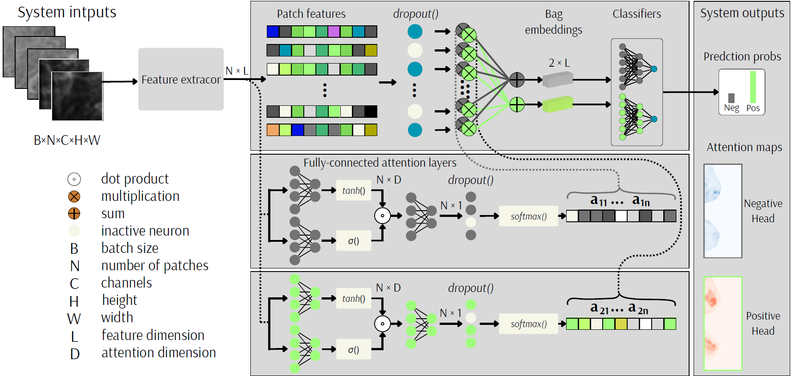

# Attention Explanation Comparison in MIL-based Models

This repository presents a comparative study of attention-based explanations in Multiple Instance Learning (MIL) for medical imaging tasks. Specifically, we contrast the original gated attention mechanism proposed by **Ilse et al. (2018)** with our **proposed multi-head attention variant**, designed to enhance interpretability and class-specific focus in multi-class classification settings.

## 🔍 Overview

We investigate how attention mechanisms distribute relevance across instances (e.g., image patches) within a bag and evaluate the **explanatory power** of these distributions.

The models compared:
- **Baseline**: Gated Attention MIL (Ilse et al., 2018)
- **Proposed**: Multi-Head Attention MIL with one head per class

  
   
  <em>Figure: Schematic of the proposed multi-head MIL attention architecture.</em>

## 🧠 Explanation Evaluation

To assess the **quality of attention-based explanations**, we employ the [**Quantus**](https://github.com/understandable-machine-intelligence/quantus) library — a Python framework for **explainability evaluation** in machine learning. Various metrics such as **Faithfulness**, **Sensitivity**, **Sparsity**, and **Localization** were used to quantitatively compare the models.

## 📊 Results

TODO (PAPER IN REVIEW)

## 📚 Reference

Ilse, M., Tomczak, J.M., & Welling, M. (2018). [Attention-based Deep Multiple Instance Learning](https://proceedings.mlr.press/v80/ilse18a.html). *Proceedings of Machine Learning Research*

---

## 🧰 Tools Used
- Python
- PyTorch
- [Quantus](https://github.com/understandable-machine-intelligence/quantus)
- Matplotlib / Seaborn (for visualization)

---

